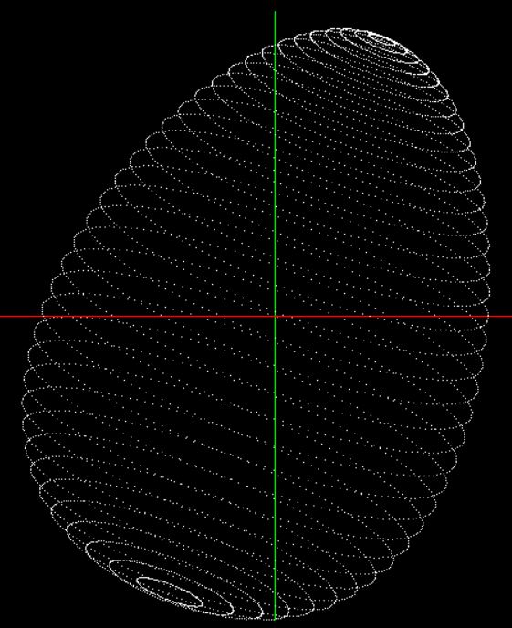
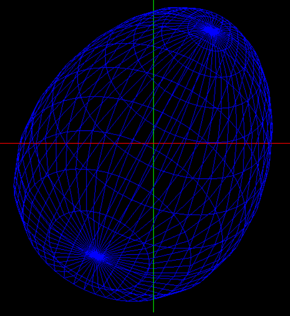
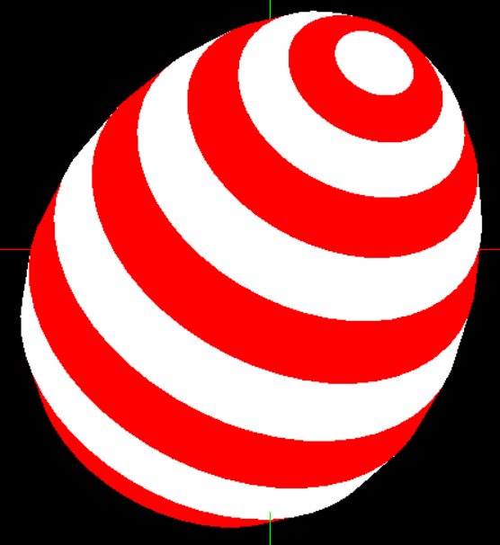
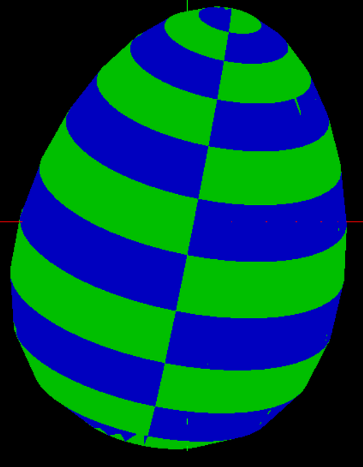

Laboratorium 2

Zadania do wykonania :

Utworzenie modelu jajka w 3-D za pomocą :

- punktów (GL_POINTS)
- linii (GL_LINES)
- trójkątów (GL_TRIANGLES)
- wstęgi trójkątów (GL_TRIANGLE_STRIP)

Efekt końcowy :

  

  

  

  

