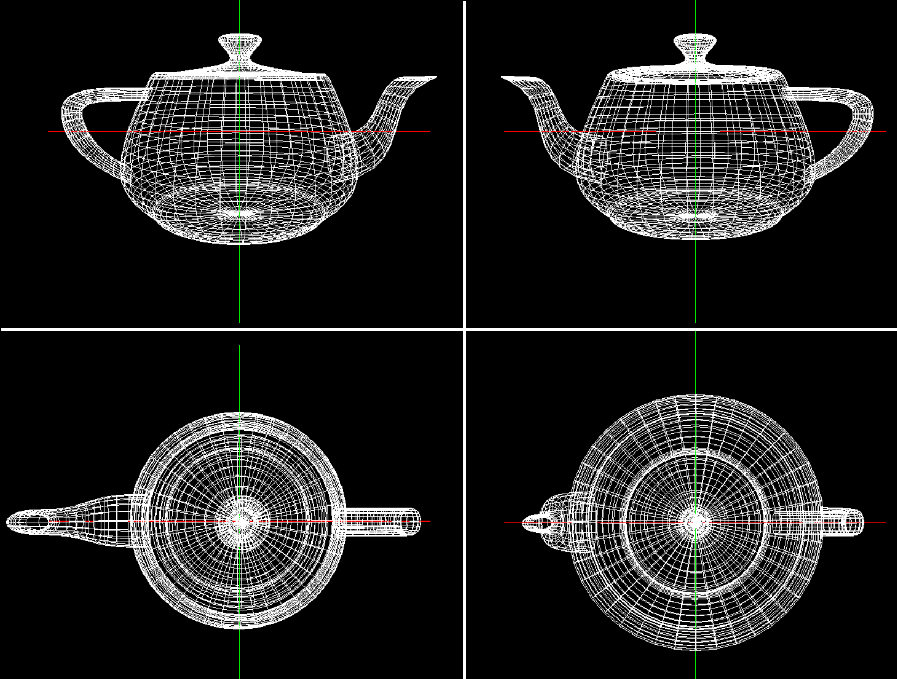
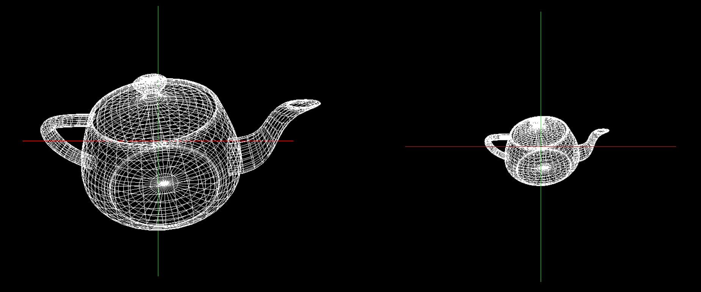

Laboratorium 3

Zadania do wykonania :

Dodanie obsługi myszki do poruszania obiektem/kamerą :

- obracanie w lewo i prawo
- obracanie w górę i dół
- przybliżanie i oddalanie

Efekt końcowy :

  

  

